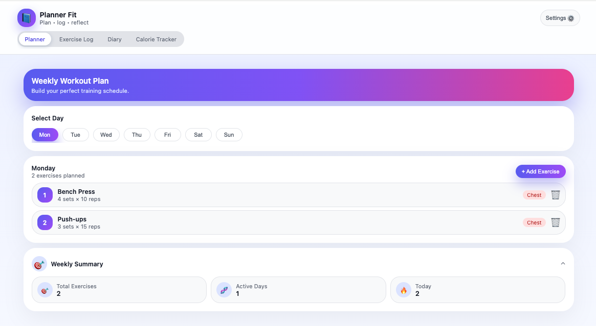
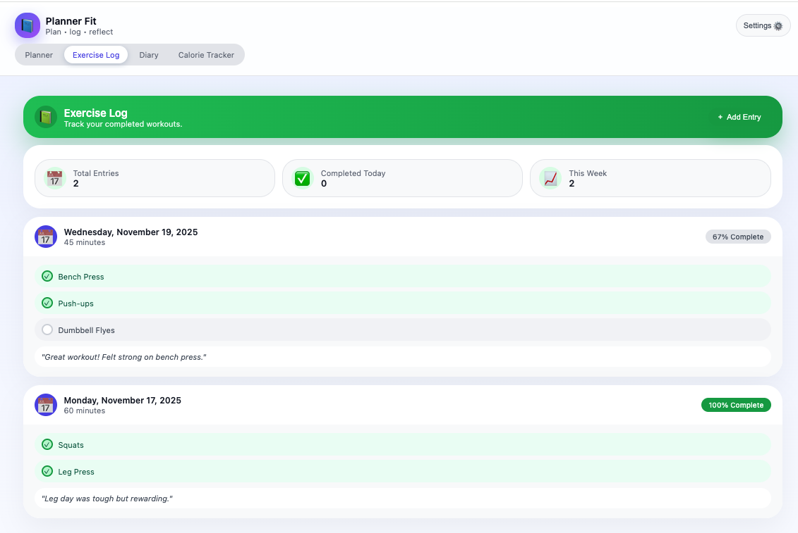
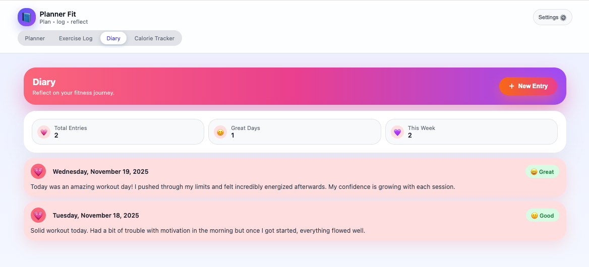

# 🏋️‍♂️ Plan Fit  
### _Plan · Log · Reflect — Your Personal Fitness Companion_

Plan Fit is a **mobile-friendly web app** built using **Lit + Vite** that helps track workouts, exercise logs, fitness diary entries, and calorie tracking — all in one place.

🔗 **Live Website:** https://mital1310.github.io/planner-fit/  
📦 **GitHub Repository:** https://github.com/mital1310/planner-fit

---

## 📸 Screenshots

| Planner Page | Exercise Log | Diary Page |
|--------------|--------------|-------------|
|  |  |  |


---

## 👥 Team & Course

| Name | Course |
|------|--------|
| **Mwambungu, Joel** | CS 6750 — Human-Computer Interaction |
| **DeLuca, Joseph J** | CS 6750 — Human-Computer Interaction |
| **Modi, Mital A** | CS 6750 — Human-Computer Interaction |
| **Shaikh, Mohammed R** | CS 6750 — Human-Computer Interaction |

---


## ✨ Features

✔️ Create weekly workout plans  
✔️ Add exercises by category (Chest, Legs, Cardio, etc.)  
✔️ Exercise Log with completion tracking  
✔️ Fitness Diary with mood & written reflection  
✔️ Mobile responsive UI  
✔️ Works fully client-side (no backend needed)  
✔️ Deployed via GitHub Pages (FREE hosting)

---

## 🛠️ Tech Stack

| Technology | Purpose |
|------------|--------|
| **Lit** | Web Components (UI) |
| **Vite** | Dev Server + Bundling |
| **TypeScript** | Type Safety |
| **GitHub Pages** | Deployment |
| **HTML/CSS** | Styling |

---

## 📦 Installation

Clone the repository:

```bash
git clone https://github.com/mital1310/planner-fit.git
cd planner-fit
